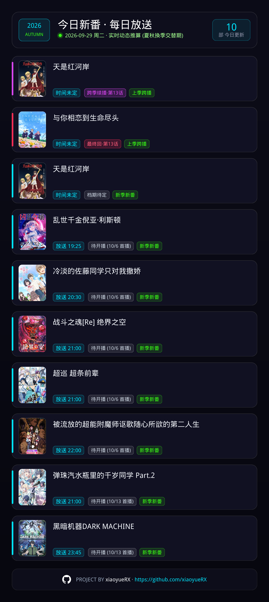
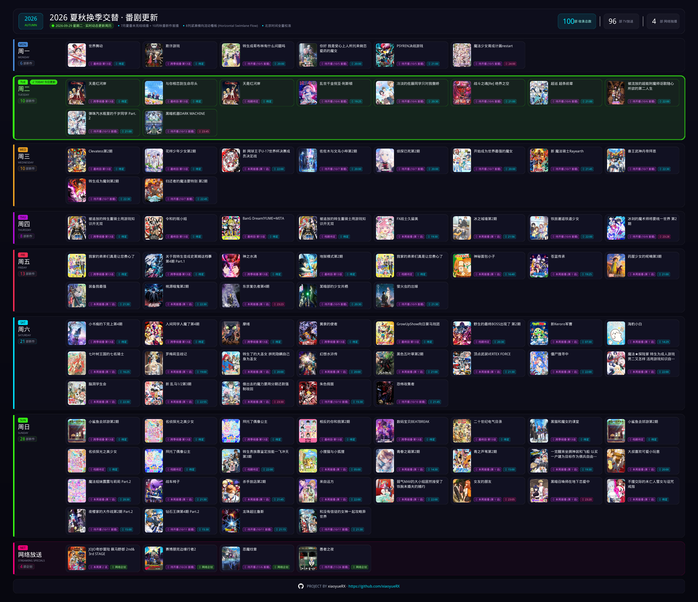

# AstrBot 番剧每日/周历推送插件 (astrbot_plugin_anidaily)

[](https://github.com/xiaoyueRX/astrbot_plugin_anidaily/blob/main/LICENSE)
[](https://github.com/xiaoyueRX/astrbot_plugin_anidaily/stargazers)
[](https://github.com/Soulter/AstrBot)
[](https://www.python.org/)

基于 [yuc.wiki](https://yuc.wiki/) 权威数据源构建的番剧排期推送与可视化看板插件。集成双轨定时推送、动态换季感知、集数推算模型与纯 Pillow 4K 极速自绘画布，为 QQ/微信/Telegram 等多平台提供高可读性、无依赖的番剧日程概览。

---

## 效果预览

### 今日番剧日报 (Daily Report)
> 每日清晨推送，自动聚焦当天播出番剧。包含动态状态徽章（待开播、本周首播、最终回、跨季续播）、北京时间换算、精美海报封面与作者署名页脚。支持 1k/2k/4k/8k/16k 多档位清晰度。



### 全景周历横向流动看板 (Weekly Overview)
> 旗舰级 8K 宽屏自适应泳道流架构（7680px Horizontal Swimlane Flow）。周一至周日独立分层，当天高亮光晕边框聚焦，多行平铺收拢，彻底消除长图留白与黑洞。



---

## 核心特性

- **双轨定时任务引擎**：支持每日番剧简报（Daily Report）与全周全景看板（Weekly Overview）独立 Cron 调度，自由定制推送频率。
- **动态换季感知体系**：在季度交替过渡窗口期（如 9/15~10/15），自动并发抓取相邻两季数据并智能合并（夏番未完结续播 + 秋番新作首播），平滑应对空档期。
- **智能集数推算模型**：根据开播日期与自然周差值，动态计算并标注 `🌟 本周首播 (第 1 话)`、`🔥 本周第 X 话`、`⏳ 待开播 (首播日期)`、`🏁 最终回` 等状态。
- **纯 Pillow 8K/多档位零依赖自绘**：全原生 Python PIL 像素级渲染，默认直出 8K（7680px）超清旗舰大图，支持 1k/2k/4k/8k/16k 多档位或自定义倍率自由调节，秒级极速产出超精细视觉大图。
- **单文件防膨胀清理机制**：采用单文件原子覆盖结合磁盘安全巡检策略，彻底根除高频渲染造成的图片碎片堆积。

---

## 安装方法

### 方式一：WebUI 插件市场安装（推荐）
在 AstrBot 的 WebUI 管理面板中进入「插件市场」，搜索 `astrbot_plugin_anidaily` 并点击安装。

### 方式二：Git 本地克隆安装
进入 AstrBot 部署目录下的 `data/plugins/`：
```bash
cd data/plugins
git clone https://github.com/xiaoyueRX/astrbot_plugin_anidaily.git
pip install -r astrbot_plugin_anidaily/requirements.txt
```
安装完成后重启 AstrBot 进程即可。

---

## 指令说明

所有指令均支持平台群聊与私聊环境：

| 指令 | 别名 / 快捷方式 | 权限要求 | 功能说明 |
| :--- | :--- | :---: | :--- |
| `/anidaily` | `/anidaily now` | 所有人 | 立即抓取最新排期并渲染发送「今日番剧日报」大图 |
| `/anidaily week` | `/aniseason` | 所有人 | 立即抓取全季排期并渲染发送「全景周历流动看板」大图 |
| `/anidaily sub` | - | 管理员 | 将当前群聊或私聊会话加入定时推送订阅名单 |
| `/anidaily unsub` | - | 管理员 | 取消当前会话的定时推送订阅 |
| `/anidaily list` | - | 管理员 | 查看当前机器人所有已订阅会话列表与统计 |

---

## WebUI 配置项

可在 AstrBot 的 WebUI「插件配置」面板中直接调整以下参数：

| 配置键名 (Key) | 数据类型 | 默认值 | 详细说明 |
| :--- | :---: | :---: | :--- |
| `enable_daily_push` | `bool` | `true` | 是否启用每日番剧推送任务（Daily Report） |
| `daily_cron_expr` | `string` | `20 8 * * *` | 每日推送 Cron 表达式（分 时 日 月 周），默认每天 08:20 |
| `enable_weekly_push` | `bool` | `true` | 是否启用全景周历看板推送任务（Weekly Overview） |
| `weekly_cron_expr` | `string` | `30 8 * * *` | 周报推送 Cron 表达式，默认每天 08:30（可设置为每周一 `30 8 * * 1`） |
| `render_scale` | `string` | `8k` | 图片渲染清晰度档位，支持 `1k`/`2k`/`4k`/`8k`/`16k` 或自定义倍率纯数值。默认 `8k` 渲染 7680px 旗舰超清大图 |
| `enable_cover` | `bool` | `true` | 是否在卡片中下载并嵌入动画封面海报 |
| `max_items` | `int` | `20` | 日报单张卡片最大允许显示的番剧条目上限 |
| `auto_clean_temp` | `bool` | `true` | 推送完成后是否自动巡检并清理历史图片缓存 |

---

## 字体与排版说明

- 插件已内置 **文泉驿微米黑 (WenQuanYi Micro Hei)** 字体（位于 `assets/font/` 目录），遵循 **Apache 2.0 / SIL Open Font License**。
- **字体检索优先级**：插件优先读取内置字体；若缺失则依次检索宿主机系统字体（Noto Sans CJK、WenQuanYi Zen Hei、LXGW WenKai 等）；如均未命中则安全回退至内置默认字体。

---

## 免责声明

1. 本插件所有新番档期与排期数据均抓取自 [yuc.wiki](https://yuc.wiki/)。数据版权归原作者所有。
2. 本项目仅供技术交流与学习使用，严禁用于任何商业牟利行为。

---

## 开源协议

本项目采用 [MIT License](LICENSE) 许可协议。
